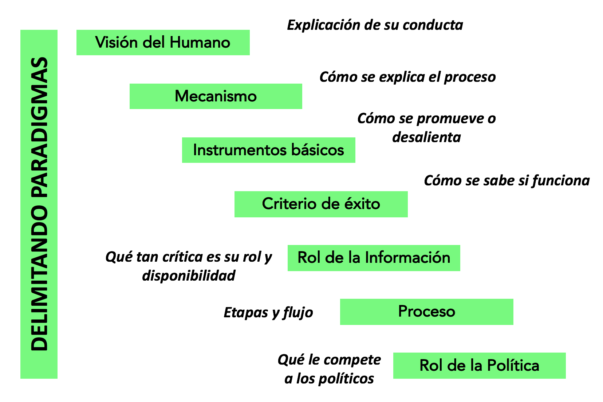
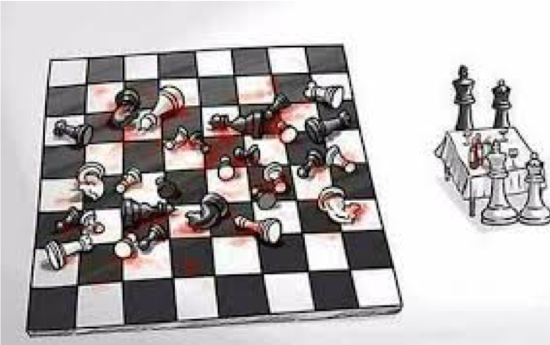
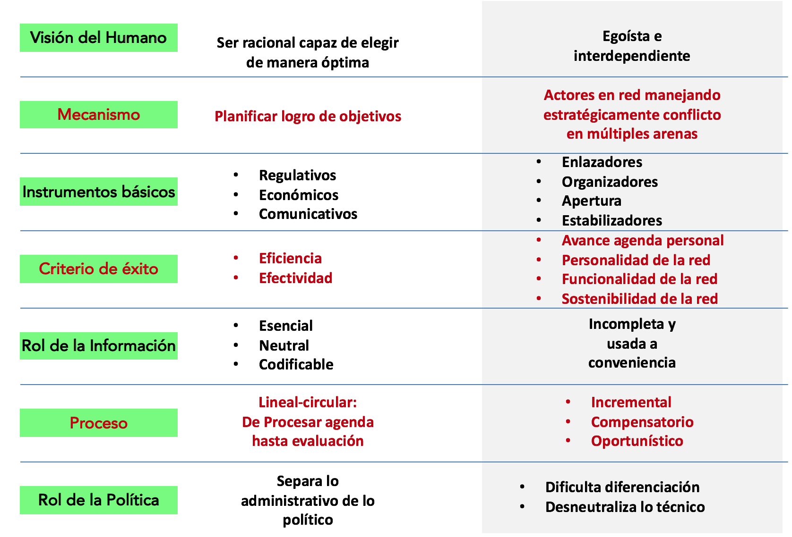
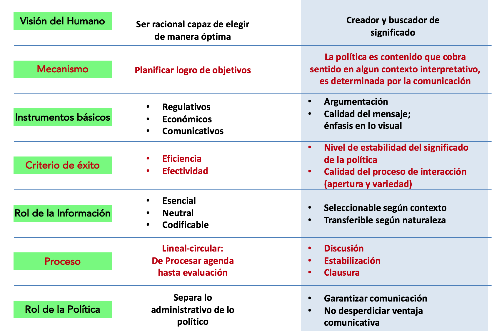
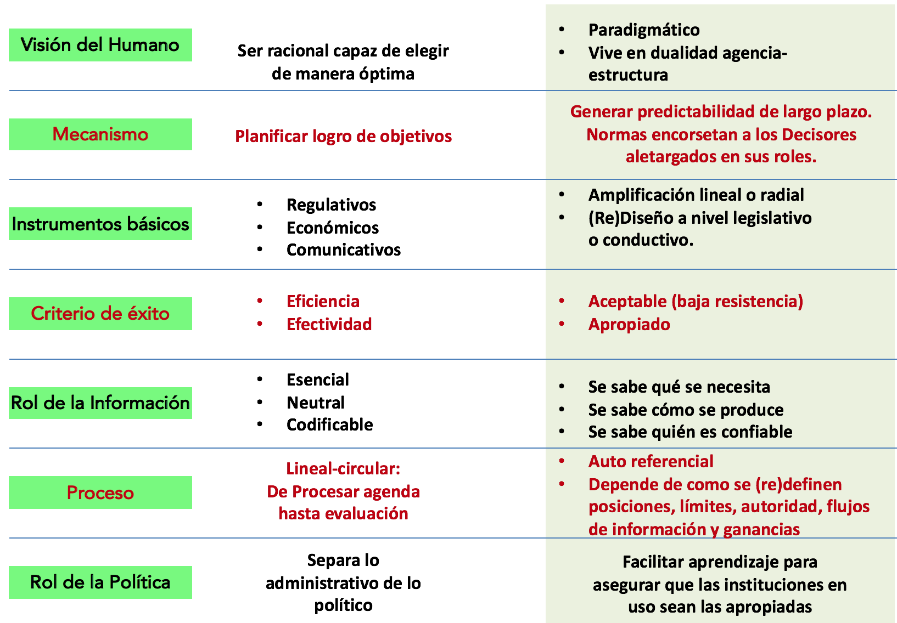

 <header><h1>GOBIERNO Y DECISIONES PUBLICAS</h1>  </header>

* Profesor:  <a href="http://www.pucp.edu.pe/profesor/jose-manuel-magallanes/" target="_blank">Dr. José Manuel Magallanes, Ph.D.</a>  
    - Profesor del Departamento de Ciencias Sociales, Sección de Ciencia Política y Gobierno.
    - [Oficina 105](https://goo.gl/maps/xuGeG6o9di1i1y5m6) - Edificio CISEPA / ECONOMIA / CCSS
    - Telefono: (51) 1 - 6262000 anexo 4302
    - Correo Electrónico: [jmagallanes@pucp.edu.pe](mailto:jmagallanes@pucp.edu.pe)
    
-----

# Sesión 2: Estrategia, Cultura e Instituciones.

La sesión anterior presentamos el paradigma racional, para ello usamos estas dimensiones para presentarlo:

{width="500px"} 

Nos toca ahora ponerlo a prueba con otros modelos.

## 1. Modelo Estratégico

{width="500px"} 

¿Cómo diferenciar el modelo racional del estratégico?

{width="500px"} 

## 2. Modelo Cultural

<iframe width="560" height="315" src="https://www.youtube.com/embed/aRfxVuSeFnk" frameborder="0" allow="accelerometer; autoplay; encrypted-media; gyroscope; picture-in-picture" allowfullscreen></iframe>

¿Cómo diferenciar el modelo racional del cultural?

{width="500px"} 

## 3. Modelo Institucional

{width="500px"} 

¿Cómo diferenciar el modelo racional del institucional?

{width="500px"}
