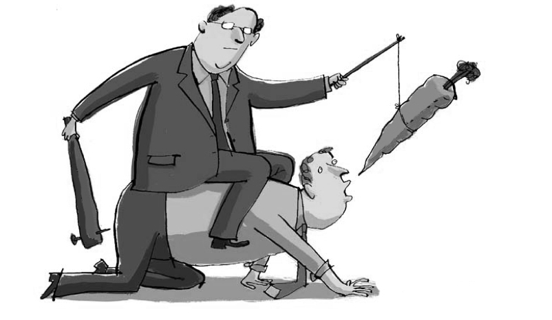

 <header><h1>GOBIERNO Y DECISIONES PUBLICAS</h1>  </header>

* Profesor:  <a href="http://www.pucp.edu.pe/profesor/jose-manuel-magallanes/" target="_blank">Dr. José Manuel Magallanes, Ph.D.</a>  
    - Profesor del Departamento de Ciencias Sociales, Sección de Ciencia Política y Gobierno.
    - [Oficina 105](https://goo.gl/maps/xuGeG6o9di1i1y5m6) - Edificio CISEPA / ECONOMIA / CCSS
    - Telefono: (51) 1 - 6262000 anexo 4302
    - Correo Electrónico: [jmagallanes@pucp.edu.pe](mailto:jmagallanes@pucp.edu.pe)
    
-----

# Sesión 1: Enfoque Racional

## 1. Presentación:

Veamos este video para entender de manera concisa el modelo racional:

<iframe width="700" height="315" src="https://www.youtube.com/embed/2dgJhuX66N0" frameborder="0" allow="accelerometer; autoplay; encrypted-media; gyroscope; picture-in-picture" allowfullscreen></iframe>
<!--
<iframe src="https://es.wikipedia.org/wiki/Racionalidad" scrolling= "yes" width="800" height="500"></iframe>
-->

-----

## 2. Delimitando el modelo

Discutamos en grupo:

### * ¿Cómo asume este modelo al ser humano?

{width="500px"} 

{width="500px"}

### * ¿Cuál es su mecanismo?

{width="500px"}

### * ¿Cuál es el rol de la información?

{width="500px"}

### * ¿Cómo es su proceso?

{width="500px"}

### * ¿Cuál es su instrumental?

{width="500px"}

### * ¿Cuáles son sus criterios de éxito?

{width="500px"}

### * ¿Cuáles es el rol de la política?

{width="500px"}

[INICIO](#beginning)