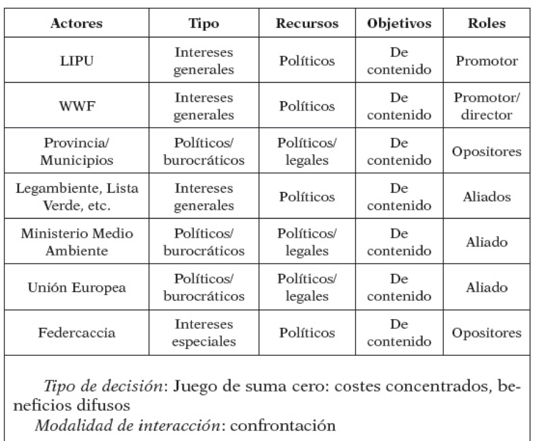
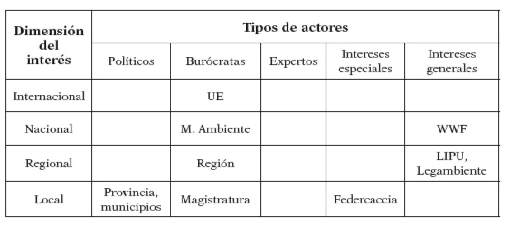
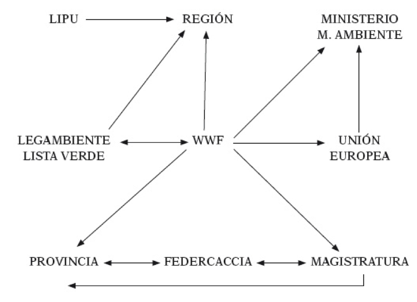
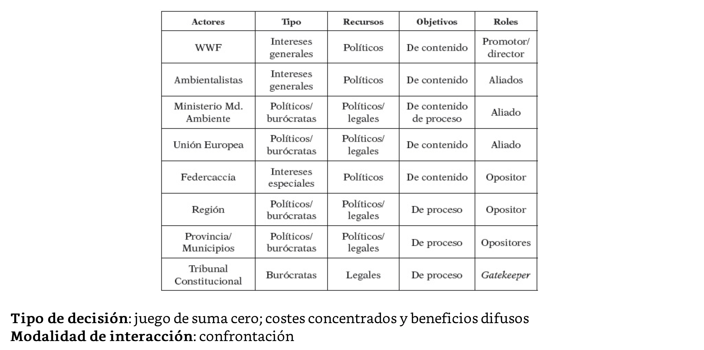
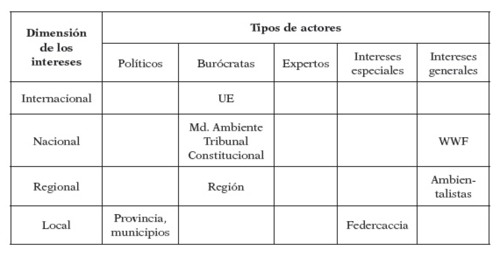
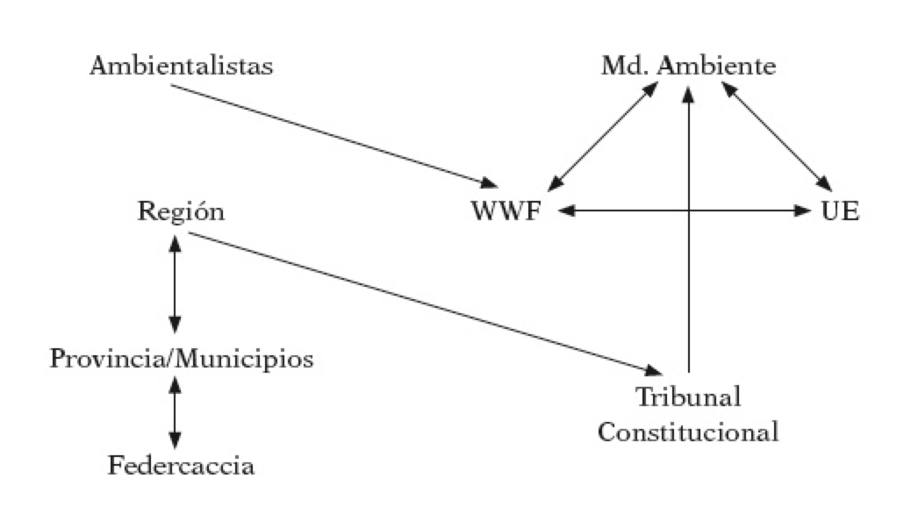
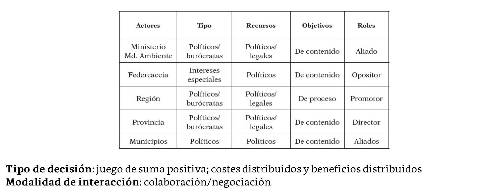
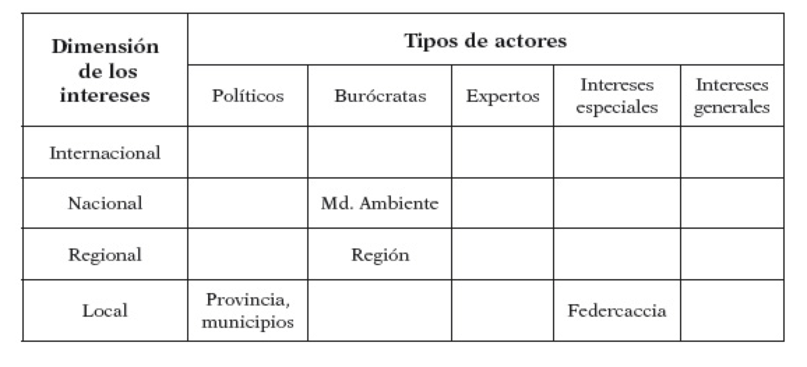
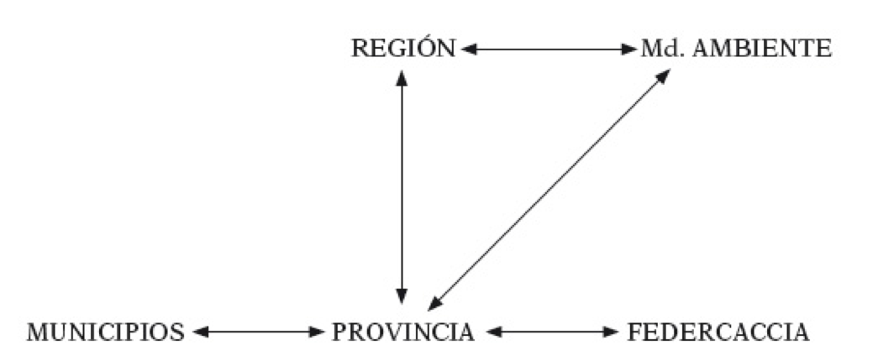

<center></center>

<center> <header><h1>GOBIERNO Y DECISIONES PUBLICAS</h1>  </header></center>

* Profesor:  <a href="http://www.pucp.edu.pe/profesor/jose-manuel-magallanes/" target="_blank">Dr. José Manuel Magallanes, Ph.D.</a> <br>
    - Profesor del Departamento de Ciencias Sociales, Sección de Ciencia Política y Gobierno.
    - [Oficina 105](https://goo.gl/maps/xuGeG6o9di1i1y5m6) - Edificio CISEPA / ECONOMIA / CCSS
    - Telefono: (51) 1 - 6262000 anexo 4302
    - Correo Electrónico: [jmagallanes@pucp.edu.pe](mailto:jmagallanes@pucp.edu.pe)
    
-----

<a id='beginning'></a>


# Sesión: Redes y Actores.

Repasemos el ejercicio planteado en el libro Decisiones Publicas de Subirats y Dente, en el apéndice del Capítulo 9. En ese ejercicio el plantea:

* Analizar la decisión en tres etapas históricas
* En cada etapa identificar a los actores y la modalidad de interacción entre estos.
* Construir una red de actores.

Recuerde que a los autores les interesa trs características de las redes de actores:

a. Complejidad: Calculada de la tabla de interacción. Indica que tanto los diversos tipos de actores están distribuidos en diversas dimensiones de interés. Esto sirve para **reflexionar**: poca complejidad podría indicar que hemos convocado mal, excesiva complejidad que hemos identificado de más. 

b. Densidad: Calculada de la red propuesta. Indica qué tan conectados están los actores. La poca densidad dificulta el diálogo entre los actores, una alta densidad podría producir mucho ruido y menos información. Los autores consideran que la a mayor densidad una red de alta complejidad con interés en colaborar puede lograr sus objetivos, pero si tiene intereses conflictivos no los lograría.

c. Centralidad: Calculada de la red propuesta. Indica qué tanto algun nodo tendría más "poder". La densidad máxima disminuye el poder de un actor particular.


### I Fase: 1986-febrero de 1990 (suspensión de las actividades en el área). Problema: ¿Diaccia Botrona tiene o no que convertirse en un área protegida?

1. Listado de actores:

{width="500px"} 

2. Modalidad de interacción de actores:


{width="500px"} 

3. Red segun libro:

{width="500px"} 

* __Reconstruyendo la red__

Datos:

<iframe height="400" src="https://docs.google.com/spreadsheets/d/e/2PACX-1vQKpd9WjJp1BNaoSI8rSXidbOSBg_QLzya6hBpL9QaShGktm-AEfbOazyhTBZxD6iZmH6e9cq50i3pj/pubhtml?gid=0&amp;single=true&amp;widget=true&amp;headers=false"></iframe>

```{r, message=FALSE, eval=TRUE}
link1="https://docs.google.com/spreadsheets/d/e/2PACX-1vQKpd9WjJp1BNaoSI8rSXidbOSBg_QLzya6hBpL9QaShGktm-AEfbOazyhTBZxD6iZmH6e9cq50i3pj/pub?gid=0&single=true&output=csv"
#leyendo data
dataFase1=read.csv(link1,header=FALSE)

#creando grafo
library(igraph)
netFase1=graph.data.frame(dataFase1,directed=TRUE)

# graficando
plot.igraph(netFase1)
```


* __Recalculando indices de red__

a. Densidad

```{r}
edge_density(netFase1)
```

b. Centralidad

```{r}
centr_degree(netFase1)$centralization
```

-----

### II FASE: febrero 1990 - mayo 1993 (ordenanza ministro Rutelli) Problema: ¿Quién tiene la responsabilidad sobre la protección de Diaccia Botrona?

1. Listado de actores:

{width="800px"} 

2. Modalidad de interacción de actores:


{width="500px"} 


3. Red segun libro:

{width="500px"} 


* __Reconstruyendo la red__

Datos:

<iframe height="400" src="https://docs.google.com/spreadsheets/d/e/2PACX-1vQKpd9WjJp1BNaoSI8rSXidbOSBg_QLzya6hBpL9QaShGktm-AEfbOazyhTBZxD6iZmH6e9cq50i3pj/pubhtml?gid=773867725&amp;single=true&amp;widget=true&amp;headers=false"></iframe>


* __Recalculando indices de red__

```{r}
link2="https://docs.google.com/spreadsheets/d/e/2PACX-1vQKpd9WjJp1BNaoSI8rSXidbOSBg_QLzya6hBpL9QaShGktm-AEfbOazyhTBZxD6iZmH6e9cq50i3pj/pub?gid=773867725&single=true&output=csv"
#leyendo data
dataFase2=read.csv(link2,header=FALSE)

#creando grafo
library(igraph)
netFase2=graph.data.frame(dataFase2,directed=TRUE)

# graficando
plot.igraph(netFase2)
```


* __Recalculando indices de red__

a. Densidad

```{r}
edge_density(netFase2)
```

b. Centralidad

```{r}
centr_degree(netFase2)$centralization
```

### III FASE: mayo 1993 - febrero 1996 Problema: ¿Cómo organizar la protección de Diaccia Botrona?

1. Listado de actores:


{width="800px"} 

2. Modalidad de interacción de actores:


{width="500px"} 


3. Red segun libro:

{width="500px"} 


* __Reconstruyendo la red__

Datos:

<iframe height="300" src="https://docs.google.com/spreadsheets/d/e/2PACX-1vQKpd9WjJp1BNaoSI8rSXidbOSBg_QLzya6hBpL9QaShGktm-AEfbOazyhTBZxD6iZmH6e9cq50i3pj/pubhtml?gid=1305292430&amp;single=true&amp;widget=true&amp;headers=false"></iframe>


```{r}
link3="https://docs.google.com/spreadsheets/d/e/2PACX-1vQKpd9WjJp1BNaoSI8rSXidbOSBg_QLzya6hBpL9QaShGktm-AEfbOazyhTBZxD6iZmH6e9cq50i3pj/pub?gid=1305292430&single=true&output=csv"
#leyendo data
dataFase3=read.csv(link3,header=FALSE)

#creando grafo
library(igraph)
netFase3=graph.data.frame(dataFase3,directed=TRUE)

# graficando
plot.igraph(netFase3)
```


* __Recalculando indices de red__

a. Densidad

```{r}
edge_density(netFase3)
```

b. Centralidad

```{r}
centr_degree(netFase3)$centralization
```